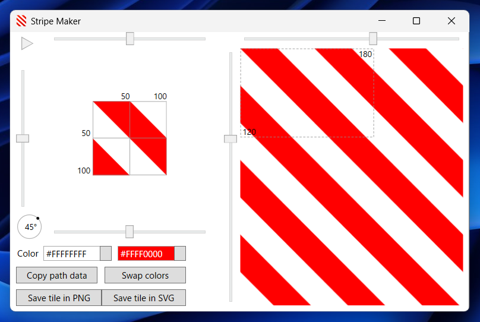
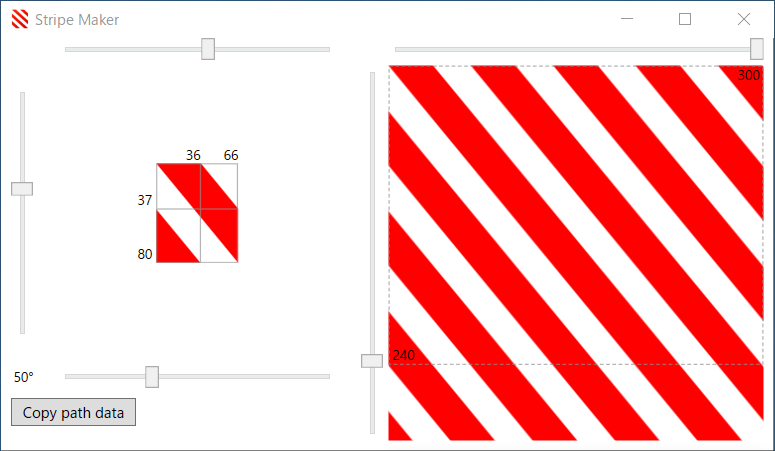
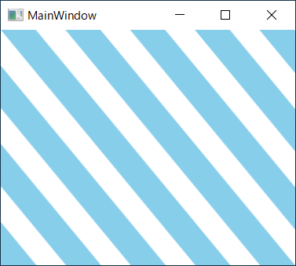

# Stripe Maker

Stripe Maker is a design tool to create the tile visuals for striped background. It enables the user to try and see the elements of visuals for stripes with interactive live preview.

<br />
(Microsoft Store version)

## Requirements

 * Windows 10 or newer
 * .NET Framework 4.8

## Usage

The visuals for stripes can be defined by 3 elements:

 * Offset from the origin (left-top corner) to cross line in the middle
 * Width of tile
 * Height of tile

You can adjust the offset (top slider), width (bottom slider) and height (left slider) to change the angle, thickness and distance of stripes. The change will be instantly reflected to preview area. In Microsoft Store version, you can change colors and direction, and swap colors.

https://user-images.githubusercontent.com/7205690/154844707-3e3a8384-3891-474c-8226-a7513784ad4d.mp4

Once you get a satisfactory combination of elements, you can copy its path data in [Path Markup Syntax](https://docs.microsoft.com/en-us/dotnet/desktop/wpf/graphics-multimedia/path-markup-syntax) for XAML. For example, when you want to fill 300x240 area with rotationally symmetric stripes and adjust elements as shown below. 



The path data would be something like below.

```
M 0,0 L 65.88,79.76 L 65.88,36.55 L 35.69,0 z M 0,79.76 L 35.69,79.76 L 0,36.55 z
```

 You can use this data for `VisualBrush` to fill the background of a window. To do so, set this data to `Data` property of `Path` for VisualBrush's `Visual` property and make the width and height of VisualBrush's `Viewport` property to match those of this data.

```xml
<Window x:Class="WpfApp.MainWindow"
        xmlns="http://schemas.microsoft.com/winfx/2006/xaml/presentation"
        xmlns:x="http://schemas.microsoft.com/winfx/2006/xaml"
        Title="MainWindow" SizeToContent="WidthAndHeight">
    <Grid Width="300" Height="240">
        <Grid.Background>
            <VisualBrush TileMode="Tile" Stretch="Fill"
                         Viewport="0,0,65.88,79.76" ViewportUnits="Absolute">
                <VisualBrush.Visual>
                    <Path Data="M 0,0 L 65.88,79.76 L 65.88,36.55 L 35.69,0 z M 0,79.76 L 35.69,79.76 L 0,36.55 z"
                          Fill="SkyBlue"/>
                </VisualBrush.Visual>
            </VisualBrush>
        </Grid.Background>
    </Grid>
</Window>
```

Then this window will look like as follows:



In fact, this data merely represents a set of coordinates that compose two simple polygons as described below.

| Command       | Description                             |
|---------------|-----------------------------------------|
| M 0,0         | Start drawing a trapezoid from (0,0)    |
| L 65.88,79.76 | Draw line to (65.88,79.76)              |
| L 65.88,36.55 | Draw line to (65.88,36.55)              |
| L 35.69,0     | Draw line to (35.69,0)                  |
| z             | Close drawing                           |
| M 0,79.76     | Start drawing a triangle from (0,79.76) |
| L 35.69,79.76 | Draw line to (35.69,79.76)              |
| L 0,36.55     | Draw line to (0,36.55)                  |
| z             | Close drawing                           |

You can utilize this data in other ways. Additionally, in Microsoft Store version, you can save the tile image to a file in PNG format.

## Histroy

v1.0 2022-2-20

 - Initial release

## License

 - MIT License

## Libraries

 - [XamlBehaviors for WPF](https://github.com/microsoft/XamlBehaviorsWpf)
 - [PixiEditor ColorPicker](https://github.com/PixiEditor/ColorPicker)

## Developer

 - emoacht (emotom[atmark]pobox.com)
 